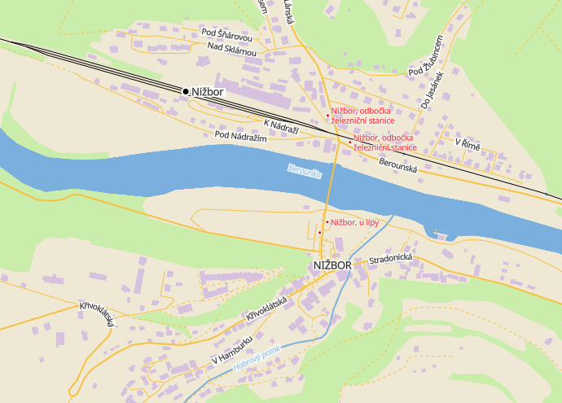
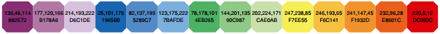

# Vincent

Very simple style focused on railways and public transport. **Work in progress - not yet usable.**

Possible use cases: those screens in the train showing you map around the train, railfan websites, planning trips to Czech countryside etc.

It will be also used as showcase of what's inside of Shortbread tiles. 

## specification

This is textual description of this style for porting it to other renderers (*WIP*):

- background `#eee8d5`
- forests (also scrub,orchard,park,cemetery) `#CAEDAB`
- water `#7BAFDE` 2px width
- buildings `#D6C1DE`
- track `#F6C141` (track,path,unclassified) 1px width dashed 2/2
- minor roads `#F6C141` (living_street,service,road,residential,cycleway,taxiway) 1px width
- major roads `#F6C141` (link,motorway,motorway_link,primary,secondary,tertiary,trunk,runway) (2px width)
- railway `#000000`
- trams `#ff0000`
- water names - `#7BAFDE` 10px italic
- secondary place names (hamlet,suburb,quarter) - black 10px
- place names (capital,state_capital,city,town,village) - black 13px CAPS LOCK
- street name (black 10px)
- tram or bus name (red 10px)
- railway stop name (black 13px)

*Icons not yet implemented nor described.*

Labels priority - railway stations > bus/tram stations > streets > place names > secondary place names.

Colors are taken from this palette [described/invented by Paul Tol](https://web.archive.org/web/20170301135346/https://personal.sron.nl/~pault/colourschemes.pdf):

*TODO: general description of cartographics decisisons - colors, categories etc...*

## limitations

Not usable above zoom 10 yet. 

Not optimised for colorblind users. I will probably implement different style/substyle later instead.

Some features are limited by using Shortbread schema, this will be adressed along the way.
